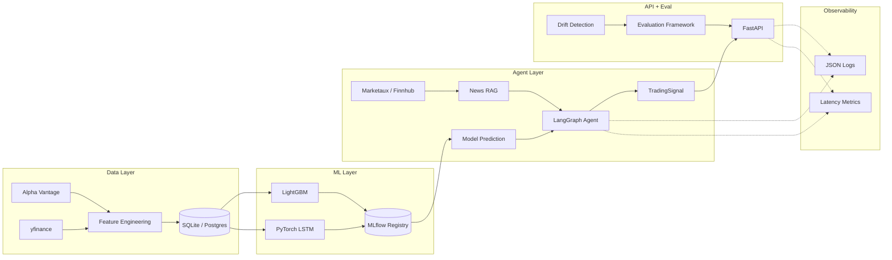

# ForexAgent

End-to-end forex trading-signal system pairing a classical ML pipeline with an agentic AI reasoning layer, packaged for production: MLflow registry, FastAPI service, Docker, CI/CD, and structured observability throughout.


---

## Why this exists

ForexAgent is a portfolio project demonstrating both classical-ML and agentic-AI engineering inside a single production-shaped architecture. Forex price prediction is the substrate; the focus is the engineering: clean interfaces, time-series CV without leakage, model registry, multi-step LLM reasoning with Pydantic-validated I/O, containerised deployment, automated evaluation, and observable behaviour at every layer.

Trading results are reported honestly. Directional accuracy on liquid FX is hard to push much above 53–55% with technical features alone; the value of the system is the engineering scaffolding around the predictions, not the predictions themselves. Returns are reported against fee-aware baselines (buy-and-hold, MA-crossover, random) so the comparison is grounded.

---

## Architecture



Five independently testable layers:

1. **Data** — pulls EUR/USD, GBP/USD, USD/JPY from Alpha Vantage (yfinance fallback), computes technical indicators (`ta` library), produces leak-free walk-forward splits, persists to SQLite (dev) or PostgreSQL (compose).
2. **Models** — LightGBM and PyTorch LSTM behind a common `BaseModel` interface; expanding-window walk-forward CV; experiments tracked in MLflow; best run promoted to the model registry.
3. **Agent** — LangGraph state machine takes the ML prediction, retrieves recent FX news via RAG, reasons in multiple steps, and emits a `TradingSignal` (BUY/SELL/HOLD + confidence + rationale) validated by Pydantic v2.
4. **Evaluation** — automated rolling evaluation against three baselines, drift detection (PSI + rolling Sharpe degradation), JSON/Markdown reports.
5. **API** — FastAPI service exposing `/predict`, `/health`, `/metrics`, `/retrain`; OpenAPI auto-docs; latency-tracking middleware; structured JSON logging end to end.

---

## Quickstart

```bash
git clone https://github.com/thanh31596/forexagent.git
cd forexagent
cp .env.example .env          # fill in API keys
make setup                    # create venv, install dev deps, install pre-commit
make train                    # train baseline models, register best in MLflow
make serve                    # start FastAPI on :8000
```

Or via Docker:

```bash
make docker-up                # postgres + mlflow + api
```

Once running:

- API docs: <http://localhost:8000/docs>
- MLflow UI: <http://localhost:5000>
- Predict: `curl -X POST localhost:8000/predict -H 'Content-Type: application/json' -d '{"pair": "EURUSD=X"}'`

---

## Project structure

```
forexagent/
├── README.md
├── Makefile
├── pyproject.toml
├── docker-compose.yml
├── Dockerfile
├── .env.example
├── .gitignore
├── .pre-commit-config.yaml
├── .github/
│   └── workflows/
│       └── ci.yml
├── src/                           # the package itself; import via `from src.X import ...`
│   ├── __init__.py
│   ├── config.py                  # all configuration + magic numbers
│   ├── data/
│   │   ├── __init__.py
│   │   ├── fetcher.py             # Alpha Vantage + yfinance backends
│   │   └── features.py            # RSI, MACD, Bollinger, MA, vol, ATR
│   ├── models/
│   │   ├── __init__.py
│   │   ├── trainer.py             # walk-forward CV + MLflow tracking
│   │   ├── lightgbm_model.py      # GBM wrapped in BaseModel interface
│   │   └── lstm_model.py          # PyTorch LSTM wrapped in BaseModel interface
│   ├── agent/
│   │   ├── __init__.py
│   │   ├── forex_agent.py         # LangGraph state machine
│   │   ├── schemas.py             # Pydantic I/O contracts
│   │   └── rag.py                 # News retrieval + Chroma index
│   ├── api/
│   │   ├── __init__.py
│   │   ├── main.py                # FastAPI app + middleware
│   │   └── routes.py              # /predict, /health, /metrics, /retrain
│   ├── evaluation/
│   │   ├── __init__.py
│   │   ├── evaluator.py           # rolling metrics + baselines
│   │   └── drift.py               # PSI + Sharpe-degradation drift
│   └── observability/
│       ├── __init__.py
│       ├── logger.py              # JSON structured logging
│       └── metrics.py             # latency tracking + JSONL sink
├── tests/
│   ├── test_data.py
│   ├── test_models.py
│   ├── test_agent.py
│   ├── test_api.py
│   └── test_evaluation.py
├── docs/
│   ├── architecture.md
│   └── design_decisions.md
└── mlruns/                        # gitignored — MLflow local store
```

Note on the package layout: `src/` is itself the importable package. This is non-standard (the conventional layout is `src/forexagent/`) but kept this way to match the repo organisation. Import statements look like `from src.config import settings`.

---

## Configuration

All configuration lives in `src/config.py` (Pydantic Settings) and is overridden via environment variables or a `.env` file. No magic numbers in code — every tunable lives here under a named constant.

Required environment variables:

| Variable | Purpose | Required? |
|---|---|---|
| `ALPHA_VANTAGE_API_KEY` | Market data backfill | Recommended (falls back to yfinance) |
| `OPENAI_API_KEY` | LLM backend for the agent | Yes |
| `MARKETAUX_API_KEY` | News retrieval for RAG | Yes (or `FINNHUB_API_KEY`) |
| `DATABASE_URL` | SQLite path or Postgres URI | No (defaults to local SQLite) |
| `MLFLOW_TRACKING_URI` | MLflow server endpoint | No (defaults to local `mlruns/`) |
| `LOG_LEVEL` | `DEBUG` / `INFO` / `WARNING` / `ERROR` | No (defaults to `INFO`) |
| `ENV` | `dev` / `staging` / `prod` | No (defaults to `dev`) |

---

## Common commands

```bash
make help                # list all targets
make setup               # initial environment + pre-commit install
make format              # black + isort
make lint                # flake8 with black-compatible rules
make typecheck           # mypy --strict on src/
make test                # pytest with coverage
make test-fast           # skip slow + integration markers
make check               # format + lint + typecheck (run before push)
make train               # train models, register best in MLflow
make serve               # uvicorn on :8000 with reload
make evaluate            # run evaluation against baselines
make mlflow-ui           # MLflow UI on :5000
make docker-up           # full stack via compose
make lock                # regenerate requirements.txt from pyproject
```

---

## Design decisions

Full rationale lives in [`docs/design_decisions.md`](docs/design_decisions.md). Headlines:

- **LangGraph over plain LangChain `AgentExecutor`.** Multi-step reasoning is a state-machine problem, and LangGraph is the current idiom. The legacy `AgentExecutor` pattern reads as dated in 2026 code review.
- **Walk-forward CV with expanding window.** FX is non-stationary; sliding windows discard exactly the regime information the model needs. Configurable via `WALK_FORWARD_STRATEGY` if you want to compare.
- **MLflow with Postgres + minio backend in compose.** Reviewers see the real production pattern, not just a local file store. Local `mlruns/` still works for dev.
- **LightGBM as the headline classical model.** Consistently faster than XGBoost on FX tabular features with comparable accuracy and native categorical-feature handling.
- **LSTM included for architectural breadth, not headline metrics.** GBM consistently wins on directional accuracy with tabular indicator features. The eval framework reports both; this README does not hide the result.
- **Pydantic v2 at every boundary.** Configuration, agent tool I/O, API request/response. Validation failures should surface as `422`s, not stack traces.
- **Observability primitives written before features.** Every component emits structured JSON logs and latency metrics from commit one, not bolted on at the end.

---

## Tech stack

| Layer | Tooling |
|---|---|
| Data | `pandas`, `yfinance`, Alpha Vantage REST, `ta` |
| Modelling | `lightgbm`, `pytorch`, `scikit-learn` |
| Experiment tracking | `mlflow` (Postgres + minio in compose) |
| Agent | `langchain-core`, `langgraph`, `langchain-openai` |
| Retrieval | `chromadb`, Marketaux / Finnhub APIs |
| API | `fastapi`, `uvicorn`, `pydantic` v2, `pydantic-settings` |
| Storage | SQLite (dev), PostgreSQL (compose) |
| Observability | stdlib `logging` + `python-json-logger`, JSONL metrics sink |
| Quality | `pytest`, `hypothesis`, `black`, `flake8`, `isort`, `mypy --strict`, `pre-commit` |
| Container | Docker (multi-stage), Docker Compose |
| CI/CD | GitHub Actions |

---

## License

MIT. See [`LICENSE`](LICENSE).

## Author

**Stephen Kim** — ML/AI Engineer, PhD (CS, QUT)
[GitHub](https://github.com/thanh31596) · [LinkedIn](https://www.linkedin.com/in/thanh31596/)
